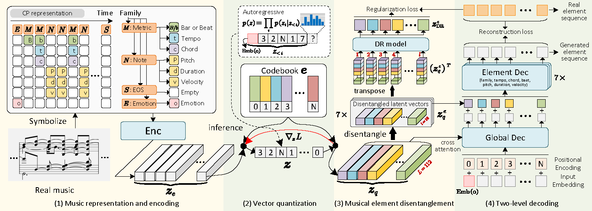

# MusER
This is the official implementation of **MusER (AAAI'24)**, which employs musical element-based regularization in the latent space to disentangle distinct musical elements, investigate their roles in distinguishing emotions, and further manipulate elements to alter musical emotions.
- [Paper link](https://arxiv.org/abs/2312.10307)
- Check our [demo page](https://tayjsl97.github.io/demos/aaai) and listen!<br>



## Requirements
The dependency packages can be found in `requirements.txt` file. One can use `pip install -r requirements.txt` to configure the environment. We use `python 3.8` under `Ubuntu 20.04.6 LTS` to run the experiments. We highly recommend using the conda environment for deployment.

## Running the experiments
1.First, train the `MusER`, use the following command:
```{sh}
python MusER.py --data_path ./data/co-representation/emopia_data.npz --dataset emopia --model_path your_model_saving_path --log_path your_log_path 
```
Explanations on the parameters:

`data_path`: training data path.

`dataset`: which dataset to train, choices include `emopia` and `ailabs` and should be consistent with data_path.
<br>

2.Then, run the VQ_explore.py to get VQ_dict.data (store codebook discrete indexes that are actually used during training) for training prior model and to visulize the latent space:
```{sh}
python VQ_explore.py --data_path ./data/co-representation/emopia_data.npz --VQ_VAE MusER_TRANS_CA_GE_emopia --plot_flag True 
```
Explanations on the parameters:

`VQ-VAE`: the name of the trained VQ-VAE model, such as `MusER_TRANS_CA_GE_emopia`.

`plot_flag`: whether to plot latent space visualization map, boolean variable.
<br>

3.Next, train the conditional autoregressive prior model:
```{sh}
python Prior_train.py --data_path ./data/co-representation/emopia_data.npz --dataset emopia --VQ_VAE MusER_TRANS_CA_GE_emopia --model_path your_prior_model_saving_path --log_path your_log_path 
```
<br>

4.Finally, generate music using your trained MusER and Prior model:
```{sh}
python generate.py --VQ_prior Prior_TRANS_CA_ER_emopia --VQ_VAE MusER_TRANS_CA_GE_emopia --music_file your_music_file_name 
```
Explanations on the parameters:

`VQ_prior`: the name of the trained prior model, such as `Prior_TRANS_CA_GE_emopia`.

`VQ-VAE`: the name of the trained VQ-VAE model, such as `MusER_TRANS_CA_GE_emopia`.

`music_file`: the name of the file that stores music generated by `VQ-VAE` and `VQ_prior`.
<br>

## Reference
If you find the code useful for your research, please consider citing
```bib
@article{ji2023muser,
  title={MusER: Musical Element-Based Regularization for Generating Symbolic Music with Emotion},
  author={Ji, Shulei and Yang, Xinyu},
  journal={arXiv preprint arXiv:2312.10307},
  year={2023}
}
```


