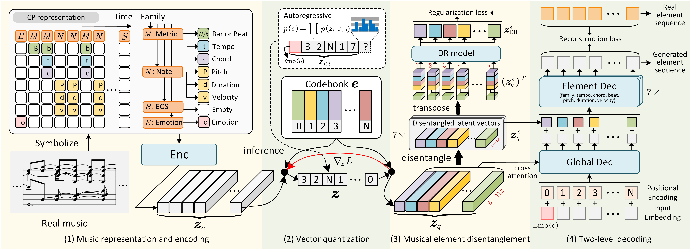

# MusER
This is the official implementation of MusER (AAAI'24), which employs musical element-based regularization in the latent space to disentangle distinct musical elements, investigate their roles in distinguishing emotions, and further manipulate elements to alter musical emotions.
- [Paper link]()
- Check our [demo page](https://tayjsl97.github.io/demos/aaai) and listen! 

